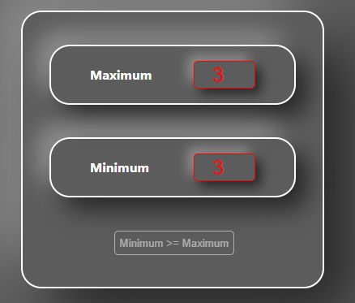

## Simple counter

### Latest version with redux

### Default start values:

- Settings panel - ON
- Maximum = 5
- Minimum = 0

Then each value (min, max, count, isSettings) stored at Local Storage.

### Errors:

- Minimum >= Maximum
- Minimum < 0
- Maximum < 0

